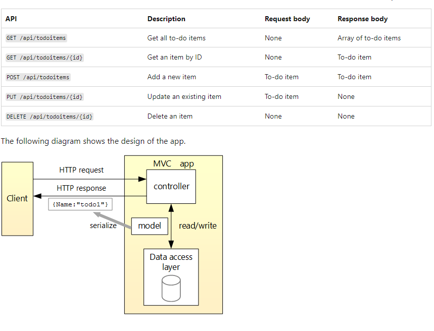
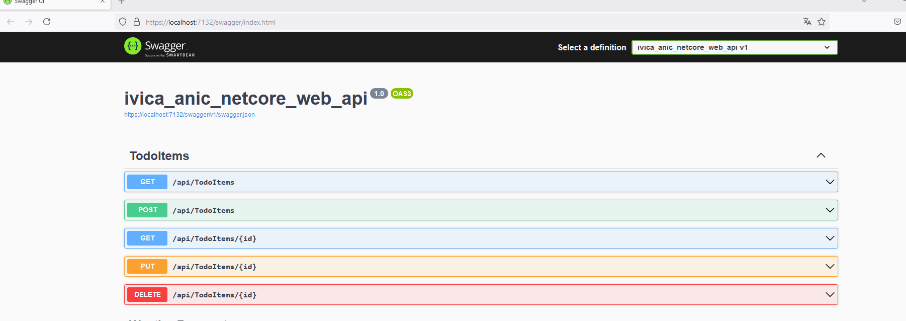
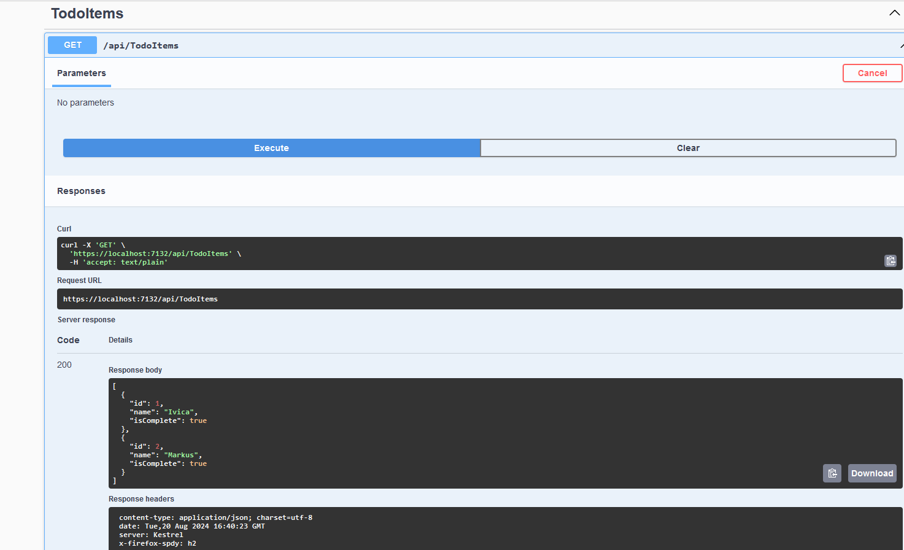
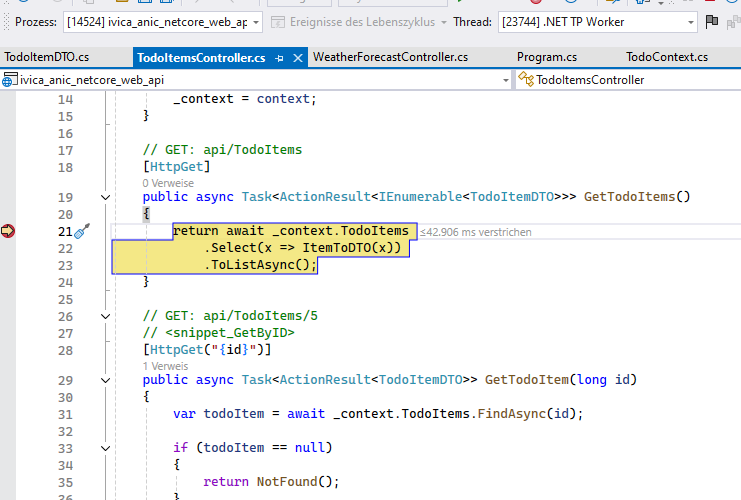
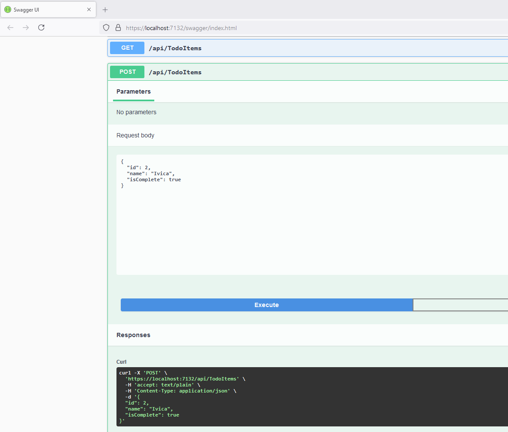
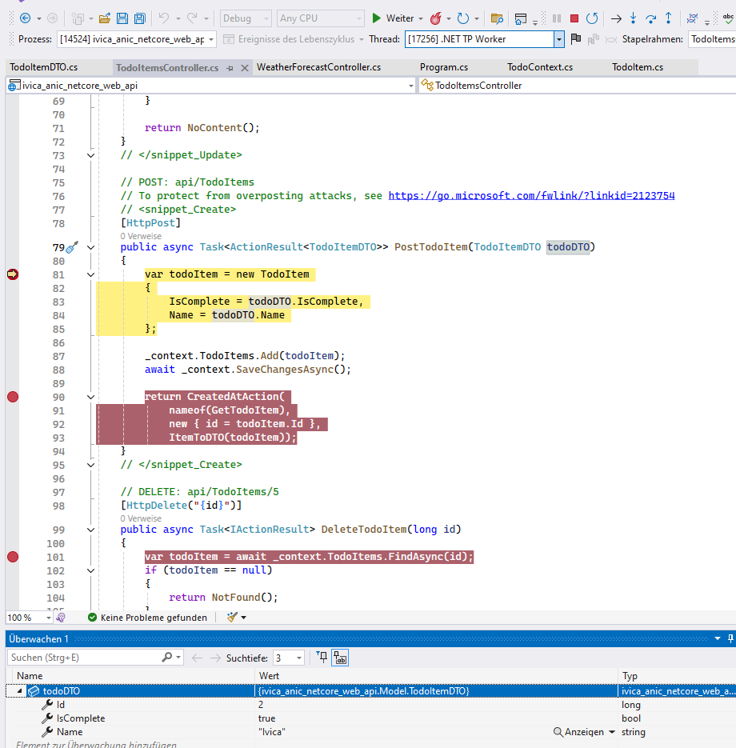
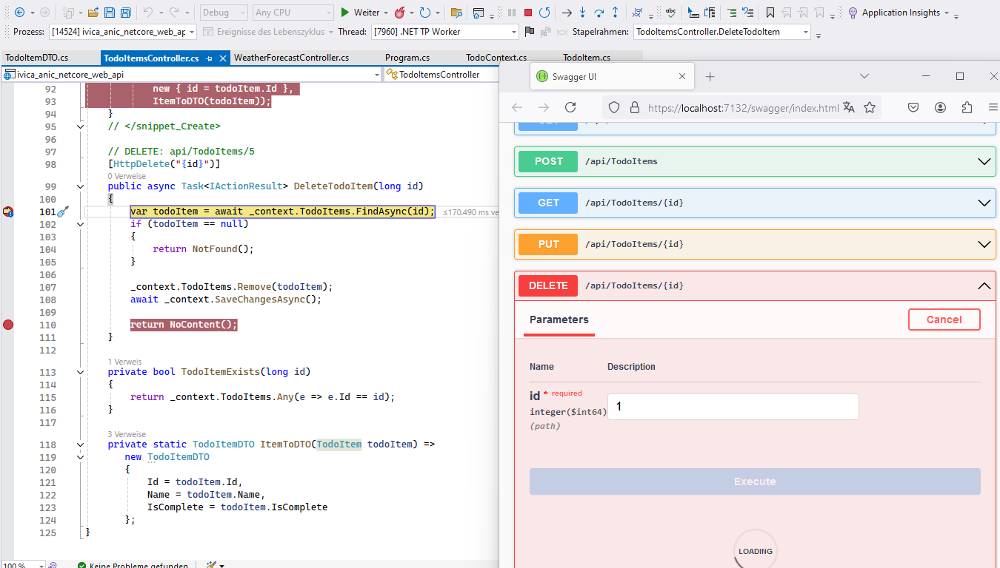

# Ivica Anic a web API with ASP.NET Core
the basics of building a controller-based web API that uses a inmemory database.
  
Swagger Test View
  
GET swagger Test  
  
GET Visual Studio debug View 
  
POST swagger Test  
  
POST Visual Studio debug View 
  
delete swagger Test  
  

